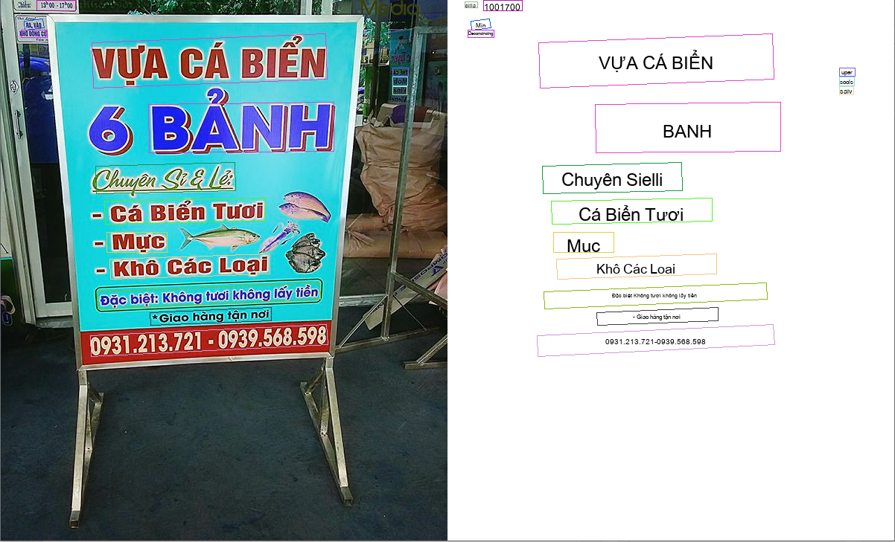

# Vietnamese_Document_Scanner

## Scene Text Detection
```bash
PaddleOCR DBnet
```
## Text Recognition
```bash
vietocr attentionOCR
```
## Install
```bash
    git clone https://github.com/XuanTung4501/Vietnamese_OCR_Pipeline
    cd Vietnamese_OCR_Pipeline
    
    #install dependencies
    pip install -r requirements.txt
```

## QuickStart
```commandline
    python main.py --image_path=path_to_image
```

#### visualize results
```commandline
    python main.py --image_path=path_to_image --visualize
```

## Result


